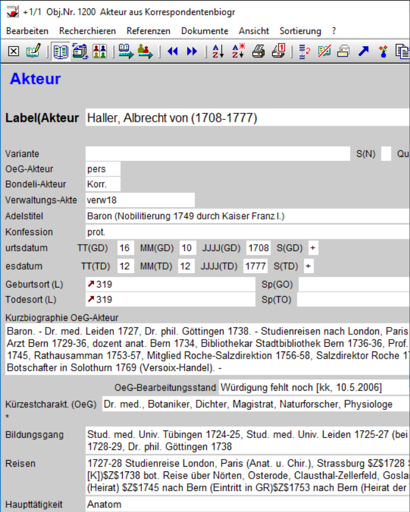

## Zur technischen Realisierung der Daten- und Editionsplattform hallerNet

*expert talk*

<style>
  .slide { background: url(img/dsl0.png) center; background-size: cover }
#  .content { filter: invert() }
  code { opacity: 0.8 }
</style>

---

[https://dsl-unibe-ch.github.io/hallernet-architecture](https://dsl-unibe-ch.github.io/hallernet-architecture)


---

<!-- Vormittag: datenzentrierte Editionsplattform -->

<span style="font-size:1em;position: absolute;right:-85px;top:0px;">Berner Haller-Forschung</span>
<style>
  .slide { background: url(img/haller-research.png) center; background-size: 93%; background-repeat: no-repeat; }
</style>

<span style="position: absolute;right:-120px;bottom:-30px;"></span>


---

```
░░░░░░░░░░░░░░░░░░░░░░░░░░░░░░░░░░░░░░░░░░░░░░░░░░░░░░░░░░░░░░░░░░░░░░░░░░░░░░░░░░░░░░░░░░░░░░░░░░░░
░░░░░░░░░░░░░░░░░░░░░░░░░░░░░░░░░░░░░░░░░░░┌────────────┐░░░░░░░░░░░░░░░░░░░░░░░░░░░░░░░░░░░░░░░░░░░
░░░░░░░░░░░░░░░░░░░░░░░░░░░░░░░░░░░░░░░░░░░│    DATA    │░░░░░░░░░░░░░░░░░░░░░░░░░░░░░░░░░░░░░░░░░░░
░░░░░░░░░░░░░░░░░░░░░░░░░░░░░░░░░░░░░░░░░░░└────────────┘░░░░░░░░░░░░░░░░░░░░░░░░░░░░░░░░░░░░░░░░░░░
░░░░░░░░░░░░░░░░░░░░░░░░░░░░░░░░░░░░░░░░░░░░░░░░░░░░░░░░░░░░░░░░░░░░░░░░░░░░░░░░░░░░░░░░░░░░░░░░░░░░
```

---


```
░░░░░░░░░░░░░░░░░░░░░░░░░░░░░░░░░░░░░░░░░░░░░░░░░░░░░░░░░░░░░░░░░░░░░░░░░░░░░░░░░░░░░░░░░░░░░░░░░░░░
░░ Gewöhnliches Dateisystem ░░░░░░░░░░░░░░░┌────────────┐░░░░░░░░░░░░░░░ Gewöhnlicher Dateiserver ░░
░░░░░░░░░░░░░░░░░░░░░░░░░░░░░░░░░░░░░░░░░░░│    DATA    │░░░░░░░░░░░░░░░░░░░░░░░░░░░░░░░░░░░░░░░░░░░
░░ TEI, ODD, Schematron, MD ░░░░░░░░░░░░░░░└────────────┘░░░░░░ Revisionskontrolle (serverseitig) ░░
░░░░░░░░░░░░░░░░░░░░░░░░░░░░░░░░░░░░░░░░░░░░░░░░░░░░░░░░░░░░░░░░░░░░░░░░░░░░░░░░░░░░░░░░░░░░░░░░░░░░
```

---

<div style="font-size:1em;position: absolute;right:-85px;bottom:50px;">Versionskontrolle<br/>
- 1 Branch<br/>
- 2 Commit-Wege <br/><span style="font-size:0.6em;">(serverseitige Edits + lokale Massenoperationen)</span>
</div>
<style>
  .slide { background: url(img/git-history.png) center; background-size: 93%; background-repeat: no-repeat; }
</style>

---
### data.hallernet (Git repository)

aktuell ca. 132'000 Dateien

```
       Git commits                                                 
                                                                                                                     
       by month                         by weekday                              by year 
       month   sum                      day	sum                             year 	sum      
       Jan	438	|████        	Mon	1356	|█████████████       	2019	1251	|████████████ 
       Feb	667	|██████      	Tue	1654	|████████████████    	2020	1726	|████████████████
       Mar	768	|███████     	Wed	1287	|████████████        	2021	1366	|█████████████
       Apr	750	|███████     	Thu	1553	|███████████████     	2022	1138	|███████████
       May	696	|██████      	Fri	1132	|███████████         	2023	1484	|██████████████
       Jun	623	|██████      	Sat	614	|██████               	2024	1212	|███████████
       Jul	827	|████████    	Sun	581	|█████                  
       Aug	765	|███████                                        
       Sep	582	|█████                                          
       Oct	786	|███████                                         
       Nov	740	|███████                                     
       Dec	535	|█████
```

---

```
╭─ ── ── ── ── ── ── ── ── ── ── ── ── ──┌─────────────────┐── ── ── ── ── ── ── ── ── ── ── ── ── ╮
│                                        │oXygen XML Editor│                                       │
 ── ── ── ── ── ── ── ── ── ── ── ── ── ─┴─────────────────┴ ── ── ── ── ── ── ── ── ── ── ── ── ── 
                                                                                                    
 
                                                                                                    
░░░░░░░░░░░░░░░░░░░░░░░░░░░░░░░░░░░░░░░░░░░░░░░░░░░░░░░░░░░░░░░░░░░░░░░░░░░░░░░░░░░░░░░░░░░░░░░░░░░░
░░ Gewöhnliches Dateisystem ░░░░░░░░░░░░░░░┌────────────┐░░░░░░░░░░░░░░░ Gewöhnlicher Dateiserver ░░
░░░░░░░░░░░░░░░░░░░░░░░░░░░░░░░░░░░░░░░░░░░│    DATA    │░░░░░░░░░░░░░░░░░░░░░░░░░░░░░░░░░░░░░░░░░░░
░░ TEI, ODD, Schematron, MD ░░░░░░░░░░░░░░░└────────────┘░░░░░░ Revisionskontrolle (serverseitig) ░░
░░░░░░░░░░░░░░░░░░░░░░░░░░░░░░░░░░░░░░░░░░░░░░░░░░░░░░░░░░░░░░░░░░░░░░░░░░░░░░░░░░░░░░░░░░░░░░░░░░░░
```

---

```
╭─ ── ── ─┬─────────────────┬ ── ── ── ── ── ── ── ── ── ── ── ── ── ── ── ── ── ── ── ── ── ── ── ╮
│         │oXygen XML Editor│ oXygen-Framework (Java) + oXygen-Plugin (Python, JavaScript)         │
 ── ── ── ┴─────────────────┴─ ── ── ── ── ── ── ── ── ── ── ── ── ── ── ── ── ── ── ▲─ ── ── ── ── 
                                                                              WebDAV ┃              
                                                                                     ┃
                                                                                     ▼              
░░░░░░░░░░░░░░░░░░░░░░░░░░░░░░░░░░░░░░░░░░░░░░░░░░░░░░░░░░░░░░░░░░░░░░░░░░░░░░░░░░░░░░░░░░░░░░░░░░░░
░░ Gewöhnliches Dateisystem ░░░░░░░░░░░░░░░┌────────────┐░░░░░░░░░░░░░░░ Gewöhnlicher Dateiserver ░░
░░░░░░░░░░░░░░░░░░░░░░░░░░░░░░░░░░░░░░░░░░░│    DATA    │░░░░░░░░░░░░░░░░░░░░░░░░░░░░░░░░░░░░░░░░░░░
░░ TEI, ODD, Schematron, MD ░░░░░░░░░░░░░░░└────────────┘░░░░░░ Revisionskontrolle (serverseitig) ░░
░░░░░░░░░░░░░░░░░░░░░░░░░░░░░░░░░░░░░░░░░░░░░░░░░░░░░░░░░░░░░░░░░░░░░░░░░░░░░░░░░░░░░░░░░░░░░░░░░░░░
```

---

<span style="font-size:1em;position: absolute;right:-85px;top:0px;">oXygen XML Editor, Textansicht</span>
<style>
  .slide { background: url(img/framework-webdav.png) center; background-size: 93%; background-repeat: no-repeat; }
</style>

---

<style>
  .slide { background: url(img/framework-setup.png) center; background-size: 93%; background-repeat: no-repeat; }
</style>

---

<span style="font-size:1em;position: absolute;right:-85px;top:10px;">oXygen XML Editor, *author mode*</span>
<style>
  .slide { background: url(img/framework-authormode.png) center; background-size: 93%; background-repeat: no-repeat; }
</style>

---

<span style="font-size:1em;position: absolute;left:-85px;bottom:0px;width:120%">Validierung, hier `tei_hal.rng` (RelaxNG) und `person.sch` (Schematron)</span>
<style>
  .slide { background: url(img/framework-schema.png) center; background-size: 93%; background-repeat: no-repeat; }
</style>
---


```
╭─ ── ── ─┬─────────────────┬ ── ── ── ── ── ── ── ── ── ── ── ── ── ── ── ── ── ── ── ── ── ── ── ╮  
│         │oXygen XML Editor│ oXygen-Framework (Java) + oXygen-Plugin (Python, JavaScript)         │◄┐
 ── ── ── ┴─────────────────┴─ ── ── ── ── ── ── ── ── ── ── ── ── ── ── ── ── ── ── ▲─ ── ── ── ──  │
                                                                              WebDAV ┃               │
                                                                                     ▼               │
░░░░░░░░░░░░░░░░░░░░░░░░░░░░░░░░░░░░░░░░░░░░░░░░░░░░░░░░░░░░░░░░░░░░░░░░░░░░░░░░░░░░░░░░░░░░░░░░░░░░ │
░░ Gewöhnliches Dateisystem ░░░░░░░░░░░░░░░┌────────────┐░░░░░░░░░░░░░░░ Gewöhnlicher Dateiserver ░░ │
░░░░░░░░░░░░░░░░░░░░░░░░░░░░░░░░░░░░░░░░░░░│    DATA    │░░░░░░░░░░░░░░░░░░░░░░░░░░░░░░░░░░░░░░░░░░░ │
░░ TEI, ODD, Schematron, MD ░░░░░░░░░░░░░░░└────────────┘░░░░░░ Revisionskontrolle (serverseitig) ░░ │
░░░░░░░░░░░░░░░░░░░░░░░░░░░░░░░░░░░░░░░░░░░░░░░░░░░░░░░░░░░░░░░░░░░░░░░░░░░░░░░░░░░░░░░░░░░░░░░░░░░░ │
                                                                                 TEI ║               │
                                                                                     ▼               │
                                                                   ╭───────────────────────────────╮ │
                                                                   │ Backend:                      │ │
                                                                   │ Transformations-Pipelines     │ │
                                                                   ├───────────────────────────────┤ │
                                                                   │  XSLweb (XSLT 3.0)            ├─┘
                                                                   │  EXPath HTTP Client           │  
                                                                   ╰───────────────────────────────╯  
```

---

<span style="font-size:1em;position: absolute;right:-85px;bottom:30px;">XSLWeb [🔗](https://github.com/Armatiek/xslweb)<br/> *Request dispatcher* für Such-Indexierung</span>

```xml
<?xml version="1.0" encoding="UTF-8"?>
<xsl:transform 
  …
  version="3.0">
 
  <!-- snip ✂ -->
  
  <xsl:template name="api-index-single" 
    match="/req:request[matches(req:path ,'^/api/index/'||
    $platformObjectTypes||'/|d{5}/?$')]">
    <xsl:variable name="type" select="/req:request/req:path => 
      substring-after('/api/index/') => substring-before('/')"/>
    <pipeline:pipeline>
      <pipeline:transformer name="pipeline-step1" 
        xsl-path="lib/api/index/index-{$type}.xsl" log="true"/>
    </pipeline:pipeline>
  </xsl:template>
  
  <!-- snip ✂ -->
 
</xsl:transform>
```

---

```
╭─ ── ── ─┬─────────────────┬ ── ── ── ── ── ── ── ── ── ── ── ── ── ── ── ── ── ── ── ── ── ── ── ╮  
│         │oXygen XML Editor│ oXygen-Framework (Java) + oXygen-Plugin (Python, JavaScript)         │◄┐
 ── ── ── ┴─────────────────┴─ ── ── ── ── ── ── ── ── ── ── ── ── ── ── ── ── ── ── ▲─ ── ── ── ──  │
                                                                              WebDAV ┃               │
                                                                                     ▼               │
░░░░░░░░░░░░░░░░░░░░░░░░░░░░░░░░░░░░░░░░░░░░░░░░░░░░░░░░░░░░░░░░░░░░░░░░░░░░░░░░░░░░░░░░░░░░░░░░░░░░ │
░░ Gewöhnliches Dateisystem ░░░░░░░░░░░░░░░┌────────────┐░░░░░░░░░░░░░░░ Gewöhnlicher Dateiserver ░░ │
░░░░░░░░░░░░░░░░░░░░░░░░░░░░░░░░░░░░░░░░░░░│    DATA    │░░░░░░░░░░░░░░░░░░░░░░░░░░░░░░░░░░░░░░░░░░░ │
░░ TEI, ODD, Schematron, MD ░░░░░░░░░░░░░░░└────────────┘░░░░░░ Revisionskontrolle (serverseitig) ░░ │
░░░░░░░░░░░░░░░░░░░░░░░░░░░░░░░░░░░░░░░░░░░░░░░░░░░░░░░░░░░░░░░░░░░░░░░░░░░░░░░░░░░░░░░░░░░░░░░░░░░░ │
                                                                                 TEI ║               │
                                                                                     ▼               │
                          ╭───────────────────────────────╮        ╭───────────────────────────────╮ │
                          │ Such-Index                    │        │ Backend:                      │ │
                          │ (inkl. Referenz─Index)        │   XML  │ Transformations-Pipelines     │ │
                          ├───────────────────────────────┤ ◀═════ ├───────────────────────────────┤ │
                          │  Apache Solr                  │ ─────► │  XSLweb (XSLT 3.0)            ├─┘
                          │                               │        │  EXPath HTTP Client           │  
                          ╰───────────────────────────────╯        ╰───────────────────────────────╯  
```

---

<span style="font-size:1em;position: absolute;left:-85px;bottom:20px;">Suche (Solr)</span>
<style>
  .slide { background: url(img/search-solr.png) center; background-size: 93%; background-repeat: no-repeat; }
</style>
---

```
╭─ ── ── ─┬─────────────────┬ ── ── ── ── ── ── ── ── ── ── ── ── ── ── ── ── ── ── ── ── ── ── ── ╮  
│         │oXygen XML Editor│ oXygen-Framework (Java) + oXygen-Plugin (Python, JavaScript)         │◄┐
 ── ── ── ┴─────────────────┴─ ── ── ── ── ── ── ── ── ── ── ── ── ── ── ── ── ── ── ▲─ ── ── ── ──  │
                                                                              WebDAV ┃               │
                                                                                     ▼               │
░░░░░░░░░░░░░░░░░░░░░░░░░░░░░░░░░░░░░░░░░░░░░░░░░░░░░░░░░░░░░░░░░░░░░░░░░░░░░░░░░░░░░░░░░░░░░░░░░░░░ │
░░ Gewöhnliches Dateisystem ░░░░░░░░░░░░░░░┌────────────┐░░░░░░░░░░░░░░░ Gewöhnlicher Dateiserver ░░ │
░░░░░░░░░░░░░░░░░░░░░░░░░░░░░░░░░░░░░░░░░░░│    DATA    │░░░░░░░░░░░░░░░░░░░░░░░░░░░░░░░░░░░░░░░░░░░ │
░░ TEI, ODD, Schematron, MD ░░░░░░░░░░░░░░░└────────────┘░░░░░░ Revisionskontrolle (serverseitig) ░░ │
░░░░░░░░░░░░░░░░░░░░░░░░░░░░░░░░░░░░░░░░░░░░░░░░░░░░░░░░░░░░░░░░░░░░░░░░░░░░░░░░░░░░░░░░░░░░░░░░░░░░ │
                                                                                 TEI ║               │
                                                                                     ▼               │
╭─────────────────────╮   ╭───────────────────────────────╮        ╭───────────────────────────────╮ │
│IIIF-Server          │   │ Such-Index                    │        │ Backend:                      │ │
│UB Bern              │   │ (inkl. Referenz─Index)        │   XML  │ Transformations-Pipelines     │ │
├─────────────────────┤   ├───────────────────────────────┤ ◀═════ ├───────────────────────────────┤ │
│ Bildstufen (vor-    │   │  Apache Solr                  │ ─────► │  XSLweb (XSLT 3.0)            ├─┘
│ prozess.), -kacheln │   │                               │        │  EXPath HTTP Client           │  
╰─────────────────────╯   ╰───────────────────────────────╯        ╰───────────────────────────────╯  
                                                                                                      
```

---

<span style="font-size:1em;position: absolute;left:-85px;bottom:20px;">IIIF-Server (UB)</span>
<style>
  .slide { background: url(img/iiif-ub.png) center; background-size: 93%; background-repeat: no-repeat; }
</style>
---

```
╭─ ── ── ─┬─────────────────┬ ── ── ── ── ── ── ── ── ── ── ── ── ── ── ── ── ── ── ── ── ── ── ── ╮  
│         │oXygen XML Editor│ oXygen-Framework (Java) + oXygen-Plugin (Python, JavaScript)         │◄┐
 ── ── ── ┴─────────────────┴─ ── ── ── ── ── ── ── ── ── ── ── ── ── ── ── ── ── ── ▲─ ── ── ── ──  │
                                                                              WebDAV ┃               │
                                                                                     ▼               │
░░░░░░░░░░░░░░░░░░░░░░░░░░░░░░░░░░░░░░░░░░░░░░░░░░░░░░░░░░░░░░░░░░░░░░░░░░░░░░░░░░░░░░░░░░░░░░░░░░░░ │
░░ Gewöhnliches Dateisystem ░░░░░░░░░░░░░░░┌────────────┐░░░░░░░░░░░░░░░ Gewöhnlicher Dateiserver ░░ │
░░░░░░░░░░░░░░░░░░░░░░░░░░░░░░░░░░░░░░░░░░░│    DATA    │░░░░░░░░░░░░░░░░░░░░░░░░░░░░░░░░░░░░░░░░░░░ │
░░ TEI, ODD, Schematron, MD ░░░░░░░░░░░░░░░└────────────┘░░░░░░ Revisionskontrolle (serverseitig) ░░ │
░░░░░░░░░░░░░░░░░░░░░░░░░░░░░░░░░░░░░░░░░░░░░░░░░░░░░░░░░░░░░░░░░░░░░░░░░░░░░░░░░░░░░░░░░░░░░░░░░░░░ │
                                                                                 TEI ║               │
                                                                                     ▼               │
╭─────────────────────╮   ╭───────────────────────────────╮        ╭───────────────────────────────╮ │
│IIIF-Server          │   │ Such-Index                    │        │ Backend:                      │ │
│UB Bern              │   │ (inkl. Referenz─Index)        │   XML  │ Transformations-Pipelines     │ │
├─────────────────────┤   ├───────────────────────────────┤ ◀═════ ├───────────────────────────────┤ │
│ Bildstufen (vor-    │   │  Apache Solr                  │ ─────► │  XSLweb (XSLT 3.0)            ├─┘
│ prozess.), -kacheln │   │                               │        │  EXPath HTTP Client           │  
╰─────────────────────╯   ╰───────────────────────────────╯        ╰───────────────────────────────╯  
         ║ JPEG                          ║ JSON                                    ║ TEI (serialisiert
         ▼                               ▼                                         ▼      in JSON)    
 ╭────────┬─────────────────┬─────────────────────────────────────────────────────────────────────╮   
 │        │Frontend         │ JS-Framework (VueJS), XML-Utility-Funktionen, TEI2Vue-Komponente    │   
 ╰────────┴─────────────────┴─────────────────────────────────────────────────────────────────────╯   
```

---

<span style="font-size:1em;position: absolute;left:-85px;bottom:20px;">Frontend</span>
<style>
  .slide { background: url(img/frontend-editionview.png) center; background-size: 93%; background-repeat: no-repeat; }
</style>

---

```
╭─ ── ── ─┬─────────────────┬ ── ── ── ── ── ── ── ── ── ── ── ── ── ── ── ── ── ── ── ── ── ── ── ╮  
│         │oXygen XML Editor│ oXygen-Framework (Java) + oXygen-Plugin (Python, JavaScript)         │◄┐
 ── ── ── ┴─────────────────┴─ ── ── ── ── ── ── ── ── ── ── ── ── ── ── ── ── ── ── ▲─ ── ── ── ──  │
                                                                              WebDAV ┃               │
                                                                                     ▼               │
▒▒▒▒▒▒▒▒▒▒▒▒▒▒▒▒▒▒▒ ░░░░░░░░░░░░░░░░░░░░░░░░░░░░░░░░░░░░░░░░░░░░░░░░░░░░░░░░░░░░░░░░░░░░░░░░░░░░░░░░ │
▒ docs.hallernet. ▒ ░ Gewöhnliches Dateisystem ░░┌────────────┐░░░░░░░░░░ Gewöhnlicher Dateiserver ░ │
▒ org             ▒ ░░░░░░░░░░░░░░░░░░░░░░░░░░░░░│    DATA    │░░░░░░░░░░░░░░░░░░░░░░░░░░░░░░░░░░░░░ │
▒ MD, Vitepress   ▒ ░ TEI, ODD, Schematron, MD ░░└────────────┘░ Revisionskontrolle (serverseitig) ░ │
▒▒▒▒▒▒▒▒▒▒▒▒▒▒▒▒▒▒▒ ░░░░░░░░░░░░░░░░░░░░░░░░░░░░░░░░░░░░░░░░░░░░░░░░░░░░░░░░░░░░░░░░░░░░░░░░░░░░░░░░ │
                                                                                 TEI ║               │
                                                                                     ▼               │
╭─────────────────────╮   ╭───────────────────────────────╮        ╭───────────────────────────────╮ │
│IIIF-Server          │   │ Such-Index                    │        │ Backend:                      │ │
│UB Bern              │   │ (inkl. Referenz─Index)        │   XML  │ Transformations-Pipelines     │ │
├─────────────────────┤   ├───────────────────────────────┤ ◀═════ ├───────────────────────────────┤ │
│ Bildstufen (vor-    │   │  Apache Solr                  │ ─────► │  XSLweb (XSLT 3.0)            ├─┘
│ prozess.), -kacheln │   │                               │        │  EXPath HTTP Client           │  
╰─────────────────────╯   ╰───────────────────────────────╯        ╰───────────────────────────────╯  
         ║ JPEG                          ║ JSON                                    ║ TEI (serialisiert
         ▼                               ▼                                         ▼      in JSON)    
 ╭────────┬─────────────────┬─────────────────────────────────────────────────────────────────────╮   
 │        │Frontend         │ JS-Framework (VueJS), XML-Utility-Funktionen, TEI2Vue-Komponente    │   
 ╰────────┴─────────────────┴─────────────────────────────────────────────────────────────────────╯   
```


---

<span style="font-size:1em;position: absolute;left:-85px;bottom:20px;">https://docs.hallernet.org</span>

<style>
  .slide { background: url(img/docs-hallernet.png) center; background-size: 93%; background-repeat: no-repeat; }
</style>

---

## Ask the "experts"

<style>
  .slide { background: url(img/dsl1.png) center; background-size: cover }
#  .content { filter: invert() }
  code { opacity: 0.8 }
</style>